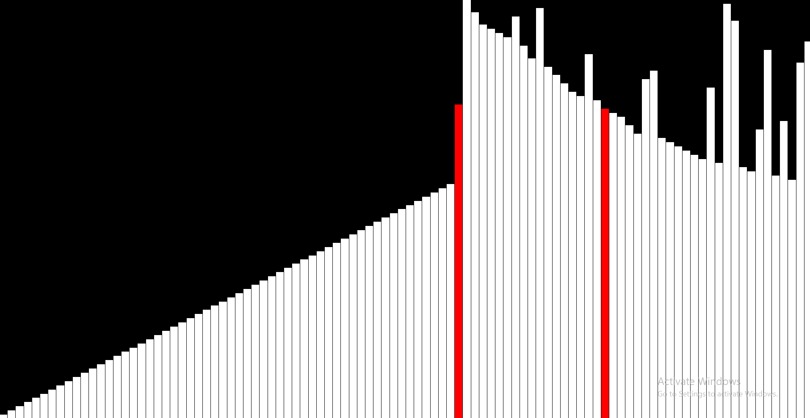

# Sort algorithm visualizer

A sorting algorithm visualizer coded in c++, rendering done with help of glfw.
Made as a project to learn c++ and opengl. This program is useful
for better understanding how sorting algorithms work.

|DEMOS                                                                         |
|:----------------------------------------------------------------------------:|
|Shell sort with 1000 items gif                                                |
|                                      |
|Exchange sort with 100 items image                                            |
|                                     |

## Implemented algorithms
- Bubble sort
- Exchange sort
- Selection sort
- Insertion sort
- Shell sort
    - using Shell's and Hibbard's increment 
- Quick sort
- Heap sort

## Controls
- **SPACE** - shuffle items
- **ENTER** - start sort
- **BACKSPACE** - interrupt sort
- **UP ARROW / DOWN ARROW** - increase / decrease time step
- **INSERT** - configure program
- **ESCAPE** - exit program

## Acknowledgments

  - [Sorting visualizer used for reference](https://github.com/alesbe/sorting-visualizer)
  - [Timo Bingmann YT channel](https://www.youtube.com/@TimoBingmann)
  - [The Cherno Batch rendering YT playlist](https://youtube.com/playlist?list=PLlrATfBNZ98f5vZ8nJ6UengEkZUMC4fy5)
